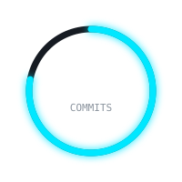
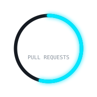
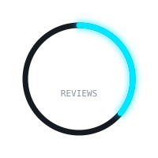
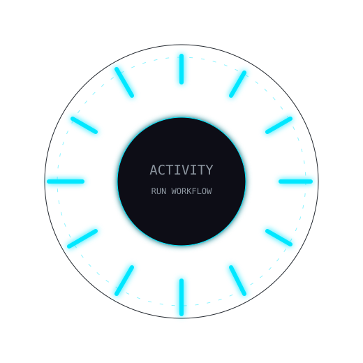

```markdown
<!-- ===================================================== -->
<!--                    PROFILE HEADER                     -->
<!-- ===================================================== -->

<div align="center">

# Hi, I'm Etory

### Software Engineering Student · Developer · AI & ML

Building software, experimenting with artificial intelligence  
and turning ideas into real projects.

<br>


</div>

<br>

---

<!-- ===================================================== -->
<!--                      ABOUT ME                         -->
<!-- ===================================================== -->

## About Me

```yaml
name: Etory
role: Software Engineering Student

interests:
  - Software Development
  - Artificial Intelligence
  - Machine Learning
  - Computer Vision
  - Backend Development
  - System Architecture

currently_working_on:
  - Sign Language Recognition
  - Computer Vision
  - AI Models

currently_learning:
  - Machine Learning
  - Deep Learning
  - Software Architecture
  - Computer Vision
```

<br>

<!-- ===================================================== -->
<!--                   DEVELOPMENT STACK                   -->
<!-- ===================================================== -->

## Development Stack

<div align="center">

### Languages


<br><br>

### Frameworks & Technologies


<br><br>

### Databases


<br><br>

### Tools


</div>

<br>

---

<!-- ===================================================== -->
<!--                    SYSTEM ACTIVITY                    -->
<!-- ===================================================== -->

<div align="center">

## System Activity

`REAL-TIME DEVELOPMENT METRICS`

<br>

<!-- Estos archivos serán generados automáticamente -->
<!-- por nuestro GitHub Action -->


&nbsp;&nbsp;

&nbsp;&nbsp;


</div>

<br>

---

<!-- ===================================================== -->
<!--                    ACTIVITY CLOCK                     -->
<!-- ===================================================== -->

<div align="center">

## Development Activity Clock

`WHEN I CODE`

<br>



<br>

Activity calculated from my GitHub contribution history.

</div>

<br>

---

<!-- ===================================================== -->
<!--                 GITHUB STATISTICS                     -->
<!-- ===================================================== -->

## GitHub Analytics

<div align="center">


</div>

<br>

<!-- ===================================================== -->
<!--                  LANGUAGE STATISTICS                  -->
<!-- ===================================================== -->

<div align="center">

## Most Used Languages


</div>

<br>

---

<!-- ===================================================== -->
<!--                  CONTRIBUTION GRAPH                   -->
<!-- ===================================================== -->

<div align="center">

## Contribution Activity


</div>

<br>

---

<!-- ===================================================== -->
<!--                    ACTIVITY SYSTEM                    -->
<!-- ===================================================== -->

<div align="center">

## Development History


</div>

<br>

---

<!-- ===================================================== -->
<!--                    PROFILE TROPHIES                   -->
<!-- ===================================================== -->

<div align="center">

## Achievements


</div>

<br>

---

<!-- ===================================================== -->
<!--                   CURRENT PROJECT                    -->
<!-- ===================================================== -->

## Current Project

### Sign Language Recognition System

Computer vision and artificial intelligence system designed to recognize and translate sign language in real time.

```text
Camera
   │
   ▼
MediaPipe
   │
   ▼
Landmark Extraction
   │
   ├───────────────┐
   ▼               ▼
  MLP             LSTM
Static Signs    Dynamic Signs
   │               │
   └───────┬───────┘
           ▼
   Hybrid Recognition
           │
           ▼
    Language Service
           │
           ▼
        Output
```

**Technologies**

`Python` · `MediaPipe` · `MLP` · `LSTM` · `Computer Vision` · `FastAPI`

<br>

---

<!-- ===================================================== -->
<!--                    FEATURED PROJECTS                  -->
<!-- ===================================================== -->

## Featured Projects

<div align="center">

<a href="https://github.com/TU_USUARIO/TU_REPOSITORIO">
  
</a>

<a href="https://github.com/TU_USUARIO/TU_REPOSITORIO_2">
  
</a>

</div>

<br>

---

<!-- ===================================================== -->
<!--                       SNAKE                           -->
<!-- ===================================================== -->

<div align="center">

## Contribution Stream


</div>

<br>

---

<!-- ===================================================== -->
<!--                       CONNECT                         -->
<!-- ===================================================== -->

<div align="center">

## Connect

<a href="https://github.com/TU_USUARIO">

</a>

<a href="TU_LINK_LINKEDIN">

</a>

<a href="mailto:TU_EMAIL">

</a>

</div>

<br>

---

<!-- ===================================================== -->
<!--                     PROFILE VIEWS                     -->
<!-- ===================================================== -->

<div align="center">


<br><br>

```text
SYSTEM STATUS: ONLINE
```

<sub>Designed and built with code.</sub>

</div>
```

Hay una parte importante: **los cuatro SVG de `./assets/` todavía hay que generarlos**. Ahí es donde podemos hacer que este README deje de parecer uno genérico y tenga los gráficos animados que pediste: reloj de 24 h, anillos de commits/PR/reviews, glow, bloom, pulsaciones y datos reales obtenidos automáticamente de GitHub.

La estructura quedaría:

```text
TU_USUARIO/
├── README.md
├── assets/
│   ├── activity-clock.svg
│   ├── commits-ring.svg
│   ├── pull-requests-ring.svg
│   ├── reviews-ring.svg
│   └── activity.svg
├── scripts/
│   └── generate-stats.js
└── .github/
    └── workflows/
        └── update-stats.yml
```

Si me das **tu nombre de usuario de GitHub**, puedo darte el siguiente bloque completo: `generate-stats.js` + los SVG circulares/reloj con **bloom animado** + `update-stats.yml`, ya configurados para que tus commits, PR y reviews se actualicen automáticamente.
